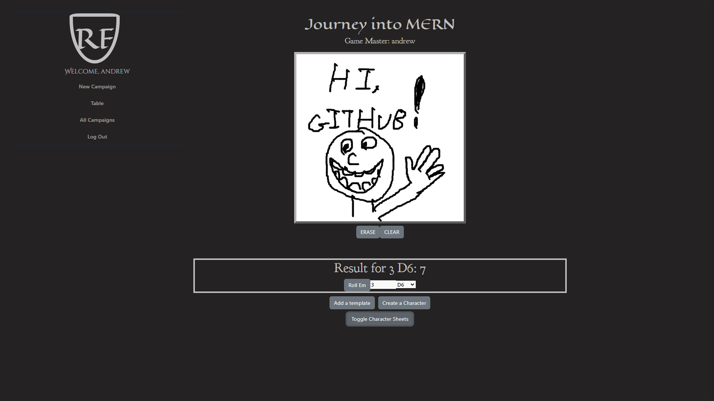

# Rogue Forge

A web application for managing character sheets for tabletop role-playing games (TTRPGs).



## Table of Contents

- [Technologies Used](#technologies-used)
- [Description](#description)
- [Features](#features)
- [Getting Started](#getting-started)
  - [Prerequisites](#prerequisites)
  - [Installation](#installation)
- [Usage](#usage)
- [Code Preview](#code-preview)
- [Icebox Features](#icebox-features)
- [Known Issues](#known-issues)

## Technologies Used

[](https://react-bootstrap.netlify.app/)
[](https://www.w3.org/Style/CSS/)
[](https://www.javascript.com/)
[](https://www.mongodb.com/)
[](https://expressjs.com/)
[](https://react.dev/)
[](https://nodejs.org/en)

## Description

Rogue Forge is a tool designed to help Game Masters (GMs) and players of tabletop RPGs manage and organize character sheets for their campaigns. It allows users to create custom character sheet templates, fill in character information, and view character details during gameplay.

## Features

- Create and manage character sheet templates with various field types (text, number, checkbox, and dropdowns).
- Generate character sheets based on selected templates and fill in character information.
- Easy Collaboration through a virtual whiteboard for dice rolling and note-taking.
- Responsive and user-friendly interface for both GMs and players.

## Getting Started
Click <a href=https://rogueforge-2c9bd98b583a.herokuapp.com>this link</a> to see live deployment
### Prerequisites

- Node.js and npm (Node Package Manager)
- MongoDB database

### Installation

1. Clone the repository:

   ```
   git clone https://github.com/AndrewDHulse/Rogue-Forge.git
   cd Rogue-Forge
   ```
2. Set up environment variables:
    Create a .env file in the root directory and add the following:
    ```
    MONGODB_URI=your-mongodb-uri
    SECRET_KEY=your-secret-key
    ```
3. Start the development server:
    ```
    npm start
    ```
## Usage

1. Sign in or create an account.
2. Create a new session or choose an existing one.
3. Manage character sheet templates in the "Templates" section.
4. Generate character sheets in the "Create a Character" section.
5. Interact with the virtual whiteboard and dice roller during gameplay.
6. View and manage character sheets in the sidebar.

## Code Preview
Rogue Forge features dynamic Character Sheet creation, handles by the dynamic and modular nature of React. 
```
  <form onSubmit={handleSubmit}>
                <label>
                    Template Name: 
                </label>
                &nbsp;
                    <input
                        type="text"
                        value={templateName}
                        onChange={handleTemplateNameChange}
                        required
                        style={{marginTop: "10"}}
                    />
                {fields.map((field, index) =>(
                    <div key={index} style={{ marginBottom: "10px" }}>
                    <CharacterSheetField
                        index={index}
                        field={field}
                        onChange={handleFieldChange}
                        handleDropdownOptionChange ={handleDropdownOptionChange}
                        handleRemoveDropdownOption={handleRemoveDropdownOption}
                        handleAddDropdownOption={handleAddDropdownOption}
                    />
```
Included is a live preview section, so DM's can see just what their players will see.
```
            {/* Preview section */}
                <h2>Preview</h2>
                <hr />
                <h3 className="preview-template-name">{templateName}</h3>
                {/* Render dynamic fields for preview */}
                {fields.map((field, index) => (
                    <div key={index}>
                        <hr />
                        {/* Render different field types */}
                        {field.type === "checkbox" && <CheckboxField label={field.label} />}
                        {field.type === "number" && <NumberField label={field.label} />}
                        {field.type === "text" && <TextField label={field.label} />}
                        {field.type === "dropdown" && (
                            <select
                                id={field._id}
                                name={field.label}
                                value={field.dropdownValue}
                                onChange={(e) => {
                                    // Dropdown logic
                                }}
                            >
                                {field.dropdownOptionsArray.map((option, optionIndex) => (
                                    <option key={optionIndex} value={option.value}>
                                        {option.label}
                                    </option>
                                ))}
                            </select>
                        )}
                    </div>
```


## Icebox Features 

Features planned to be added at a later time include:
- Implementation of socket.io
- Ability to save whiteboard
- Optional grid for whiteboard
- Ability to upload a map to the whiteboard
- Tokens for charcters on the whiteboard
- Hide character sheets from players, visible only to DM
- Premade templates for popular TTRPGs such as Pathfinder and Dungeons and Dragons 5E
- Popular systems ruleset to impact dice rolls
- A "Fudge Roll" feature for DMs
- Protected Routes for DMs
- Add and remove players to campaigns 
- Only players in the campaign can interact


## Known Issues

- Currently, when creating a character, selecting from the dropdown menu or checking the checkbox does not save, and the user must update these values from the edit function.
- The label for dropdown fields does not render in the preview. 
